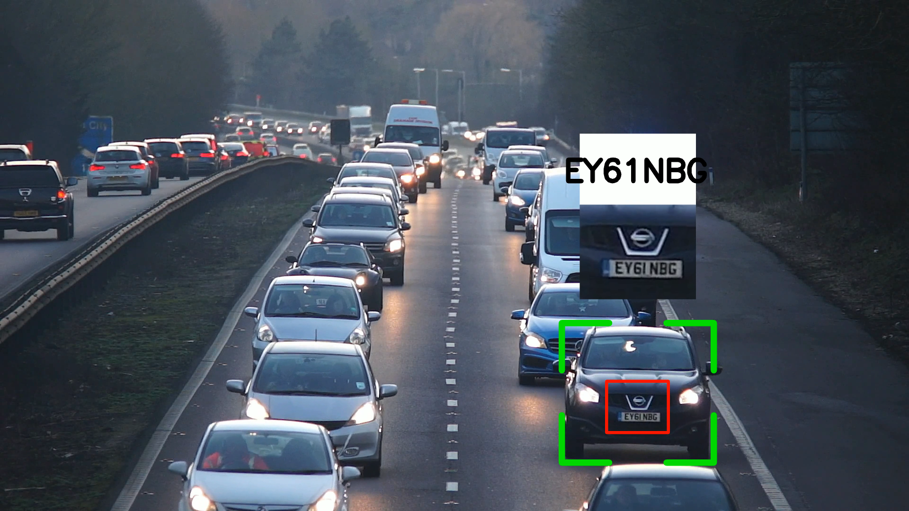

# License Plate Detection with OCR


Detect and recognize license plates of the vehicles in videos using computer vision techniques. This project utilizes deep learning and optical character recognition (OCR) to identify and extract license plate information from video streams.

## Table of Contents

- [About](#about)
- [Demo](#demo)
- [Getting Started](#getting-started)
  - [Prerequisites](#prerequisites)
  - [Installation](#installation)
- [Usage](#usage)


## About

License Plate Detection and OCR is a computer vision project that combines object detection and optical character recognition to locate and read license plates of the vehicles in videos. It uses a combination of YOLOV8 model to detect vehicles and own trained model to detect license plates. This system can be used for various applications, including automated toll collection, parking management, and security.

## Demo

This image shows a sample detection from trained model.



## Getting Started

These instructions will help you set up the project on your local machine.

### Prerequisites
Install all the required dependecies by running this command after the cloning.
```python
pip install -r requirements.txt
```
Clone [this repository](https://github.com/abewley/sort) to the same directory as main.py to download sort modules which will be needed to run the project

### Installation

Clone the repository.

```shell
git clone https://github.com/Api1998/Licence_Plate_Detection_and_OCR-Computer-Vision-Project.git
```
## Usage

It is important to provide the paths and names of the files accurately in all of the python files and keep it consistent throughout.

1. Have a video where you want to detect the licence plate of the vehicles in the same directory as main.py and specify the name of the file in main.py.

2. Then run the main.py file which will result in a test.csv file created in your directory.
3. Then run the add_missing_data.py file to do the data processing to the csv file.
4. Finally run the visualize.py file to show the detection in the video that you have supplied. This will result a video file where you can see the detetions running on the video.

### ***Important
The model provided here is just to illustrate the project idea. It is not the final output of the project where a very accurate model can be trained for real world applications,
So make sure you use a video where license plates are very visible to get a decent output.
   
